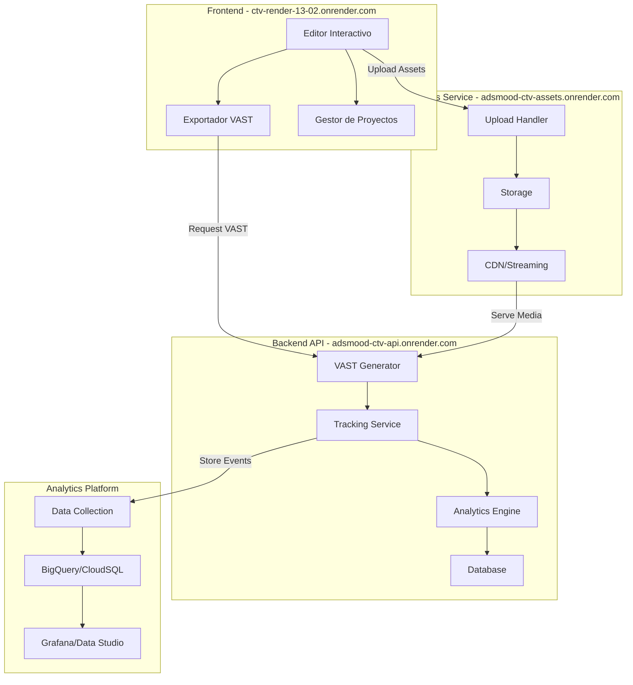

# Arquitectura del Sistema CTV Render

## Diagrama de Arquitectura



## Componentes Principales

### 1. Frontend (Editor Interactivo)
- **Tecnología**: React + TypeScript + Vite
- **Funcionalidades**:
  - Editor visual de anuncios interactivos
  - Gestión de proyectos
  - Exportación de VAST
  - Interface con servicios de assets y API

### 2. Servicio de Assets
- **Tecnología**: Node.js + Express
- **Funcionalidades**:
  - Gestión de archivos multimedia
  - Conversión de formatos de video
  - CDN para distribución de contenido
  - Streaming optimizado

### 3. Backend API
- **Tecnología**: NestJS
- **Funcionalidades**:
  - Generación dinámica de VAST XML
  - Sistema de tracking
  - Endpoints de analytics
  - Integración con DV360

### 4. Analytics Platform
- **Tecnología**: Grafana + PostgreSQL/BigQuery
- **Funcionalidades**:
  - Recolección de métricas
  - Visualización de datos
  - Comparación con DV360
  - Reportes automatizados

## Flujo de Datos

1. **Creación de Anuncio**:
   ```mermaid
   sequenceDiagram
       Editor->>Assets: Upload media files
       Assets->>Editor: Return public URLs
       Editor->>Backend: Request VAST generation
       Backend->>Editor: Return VAST XML
   ```

2. **Tracking de Eventos**:
   ```mermaid
   sequenceDiagram
       CTV Device->>Backend: Track impression/click
       Backend->>Analytics: Store event
       Analytics->>Dashboard: Update metrics
   ```

## Especificaciones Técnicas

### VAST XML Generation
```xml
<?xml version="1.0" encoding="UTF-8"?>
<VAST version="4.0">
    <Ad id="[TIMESTAMP]">
        <InLine>
            <AdSystem>AdsMood CTV</AdSystem>
            <AdTitle>Interactive CTV Ad</AdTitle>
            <Impression id="[CACHEBUSTING]">
                https://adsmood-ctv-api.onrender.com/track/impression
            </Impression>
            <Creatives>
                <Creative>
                    <Linear>
                        <Duration>00:00:30</Duration>
                        <MediaFiles>
                            <MediaFile delivery="progressive" type="video/mp4" width="1920" height="1080">
                                https://adsmood-ctv-assets.onrender.com/videos/campaign-123.mp4
                            </MediaFile>
                        </Linear>
                    </Creative>
                </Creatives>
            </InLine>
        </Ad>
    </VAST>
```

### Endpoints API

#### VAST Generation
```typescript
@Get('/vast')
async generateVAST(@Query('id') id: string): Promise<string> {
    // Generar VAST XML dinámicamente
}
```

#### Tracking
```typescript
@Post('/track/:event')
async trackEvent(@Param('event') event: string, @Body() data: any): Promise<void> {
    // Registrar evento en analytics
}
```

## Compatibilidad CTV

### Roku
- RAF Framework integration
- HTML5 interactive support
- Remote control optimization

### Fire TV
- SDK integration
- Interactive buttons support
- H.264 MP4 1080p/4K

### Apple TV
- VAST 4.0 compliance
- H.265/HEVC support
- Linear content focus

[Continuar documentación para otras plataformas...] 